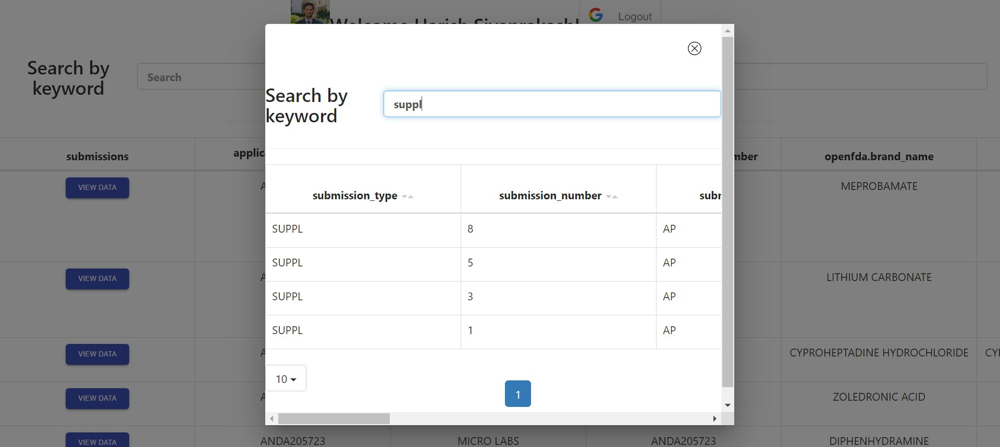

# Kyulux Take Home Coding test.

## React JS Web Application.

### Objective

Objective of the project is to retrieve data from an Drug API endpoint and show them to the user in a presentable manner. All the returned fields should be shown to the user with details. Google authentication should be provided so that only authenticated users should be able to view the data.
UI Design to be self explanatory.

### Features

1. Google Login / Logout feature. (Client ID put up in the code and is used for testing purposes, ideally should come from the environment variables)
2. JSON data retrieved using the GET API https://api.fda.gov/drug/drugsfda.json?limit=99.
3. Pagination added for the table. 
4. Columns are loaded dynamically based on the response JSON data.
5. Nested JSON objects are represented using modal dialog box. (happens recursively)
6. Sorting feature implemented on the columns which return a string type value.
7. History of modal window data is mainted, goes back to previous state on close button click
8. Response JSON data is sorted by openfda filling the first few rows followed by the rest.

### Technical details

* Front-end framework : React JS
* Sub-packages: Below is the list of dependencies used in the project.\
    "@material-ui/core": "^4.11.3", \
    "@testing-library/jest-dom": "^5.11.4", \
    "@testing-library/react": "^11.1.0",\
    "@testing-library/user-event": "^12.1.10",\
    "axios": "^0.21.1",\
    "bootstrap": "^4.6.0",\
    "react": "^17.0.1",\
    "react-bootstrap-table": "^4.3.1",\
    "react-bootstrap-table-next": "^4.0.3",\
    "react-bootstrap-table2-paginator": "^2.1.2",\
    "react-dom": "^17.0.1",\
    "react-google-login": "^5.2.2",\
    "react-scripts": "4.0.3",\
    "web-vitals": "^1.0.1"\

### Steps to run

1. "npm install" to install the node_module dependencies.
2. "npm start" to start the web application. Launches the application in web browser (http://localhost:3000)

### Screenshots

1. Google Login / Logout View

2. Table View

3. Modal Dialog View

